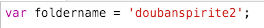

# 拇指期刊后台录入文案自动补全标签脚本
适用于JDC案例展示工具

- 可补全标签（快捷键）：
- a标签（ctrl+l）
- 案例标题（ctrl+,（逗号））
- 图片（ctrl+.（句号））
- 图片说明（ctrl+/）
- 作者（ctrl+[）
- 引用（ctrl+]）

> 注意！使用脚本添加的内容无法ctrl+z撤回！

## 使用方法：
打开Chrome Dev Tools的Sources标签下的Snippets标签

空白处右键－New
将文末的代码段复制到右侧新弹出的标签页中，保存
每次打开案例录入系统时，右键－Run，每次打开都要Run，它只是一段客户端脚本

在输入框中选中需要包裹标签的文本，然后使用对应快捷键即可。

### 2016-3-23 2.0更新

增加快捷按钮列表，运行脚本后出现在页面左侧

### 2016-3-24 3.0更新

增加图片获取文件名与尺寸，并合成标签，显示于控制台的功能

使用方法：
- 将图片上传至对应期刊下的子目录
- 将所有图片文件名放入一个pic.js中的uploadpics_maga参数中，并将其一并上传至你的图片目录中（详见pics_demo.js文件）

> 日期需在后台系统中选择准确发刊日
> 变量``foldername``需设置为当期图片所在文件夹名称
> 脚本加载之后会先进行图片的加载，因此需要等一段时间才能生成所有图片的标签

